# Paystack SPC(sms portal creator) Module
Tested on SPC4 

## :warning: **Deprecation Notice**

We regret to inform you that the Paystack SPC(sms portal creator) Module is now deprecated and will no longer be actively maintained or supported.

**Reasons for deprecation**:
- Compatibility issues with the latest software versions
- Security vulnerabilities that cannot be addressed sufficiently.
- Obsolete functionality that is no longer relevant

To ensure a seamless experience, we recommend exploring the Paystack Integrations Directory for [alternative plugins](https://paystack.com/integrations?category=automation) that are actively maintained and supported.

## Prepare

- Before you can start taking payments through Paystack, you will first need to sign up at: 
[https://dashboard.paystack.co/#/signup][link-signup]. To receive live payments, you should request a Go-live after
you are done with configuration and have successfully made a test payment.

## Installation Steps

1. Download the [mod_spc_paystack.zip][link-releases] and install via your Joomla Mange extensions page. 
	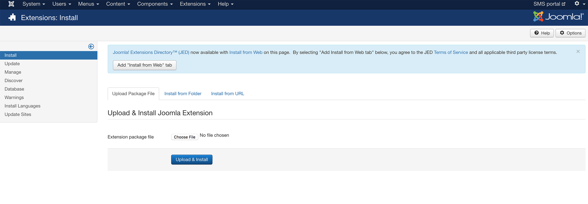

2. Navigate to your modules page & Click the `New` button. 
	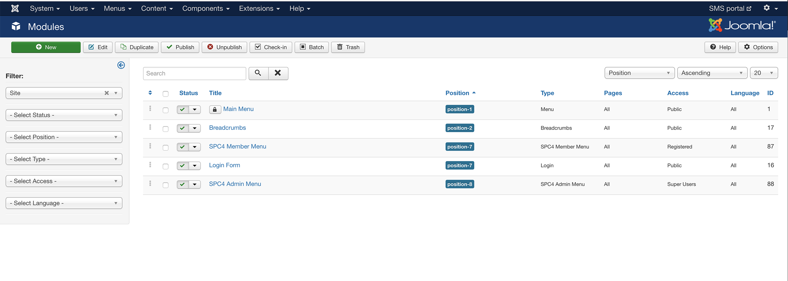

3. Click the "SPC Paystack Gateway Module" option. 
	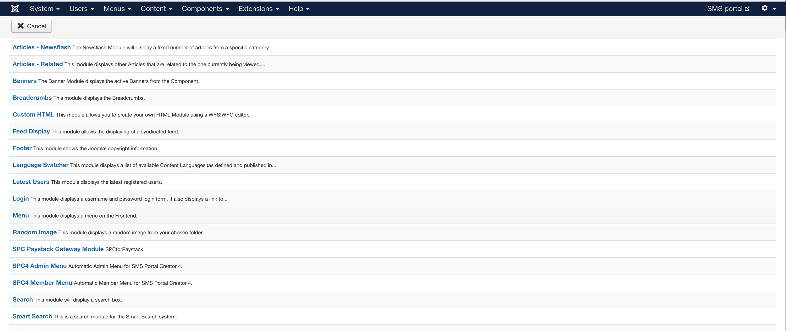

4. Copy your API keys from your [Paystack Dashboard Settings][link-developer] and paste them on the module settings. 
	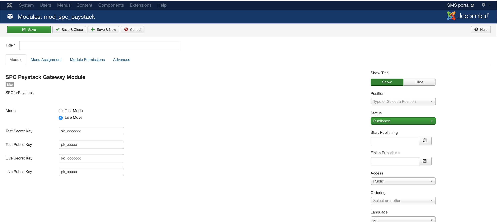

5. Create a new position by typing `spc_paystack` in the position field on the right side of the page. After creating it, save the module.
	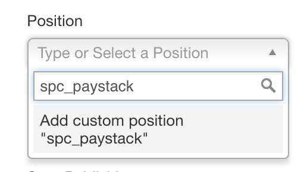
	***
	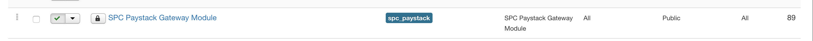

6. Create the article(page) that will be the **buy SMS** page. 
	- Click on add new Article. 
	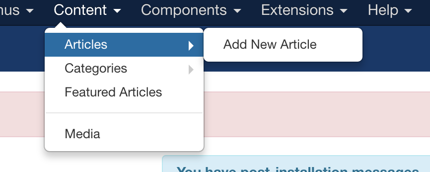

	- On the article content, paste the text `{loadposition spc_paystack}`
	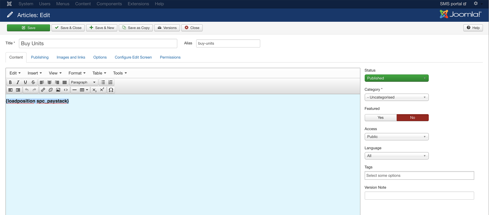

7. Link the article(page) to your main menu: 
	- Click on add new Menu Item under the main menu. 
	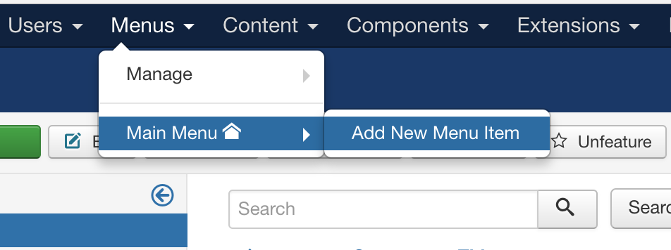
	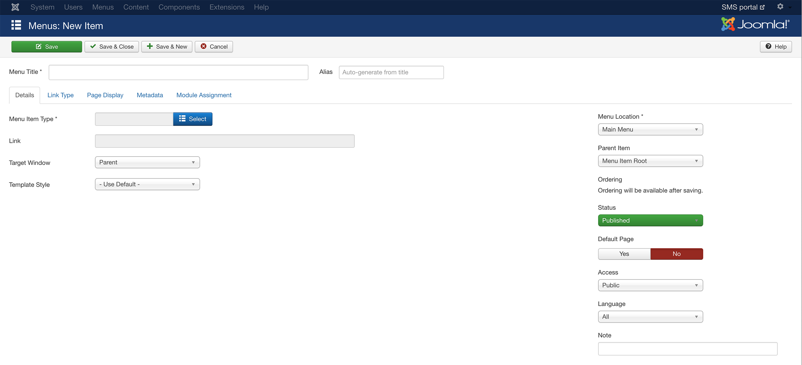

8. Click the select button beside the **Menu Item Type** option and select **Single article** under Articles on the popup overlay. 
	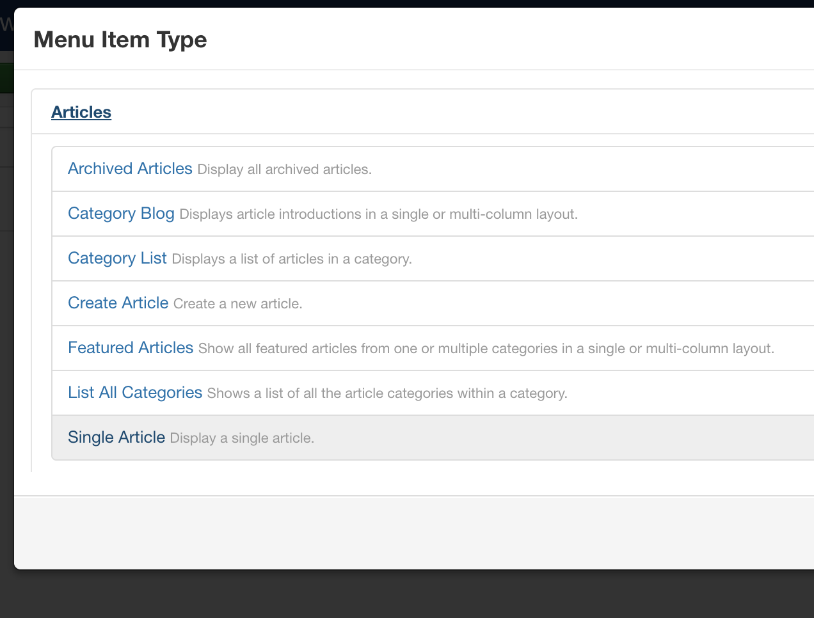
	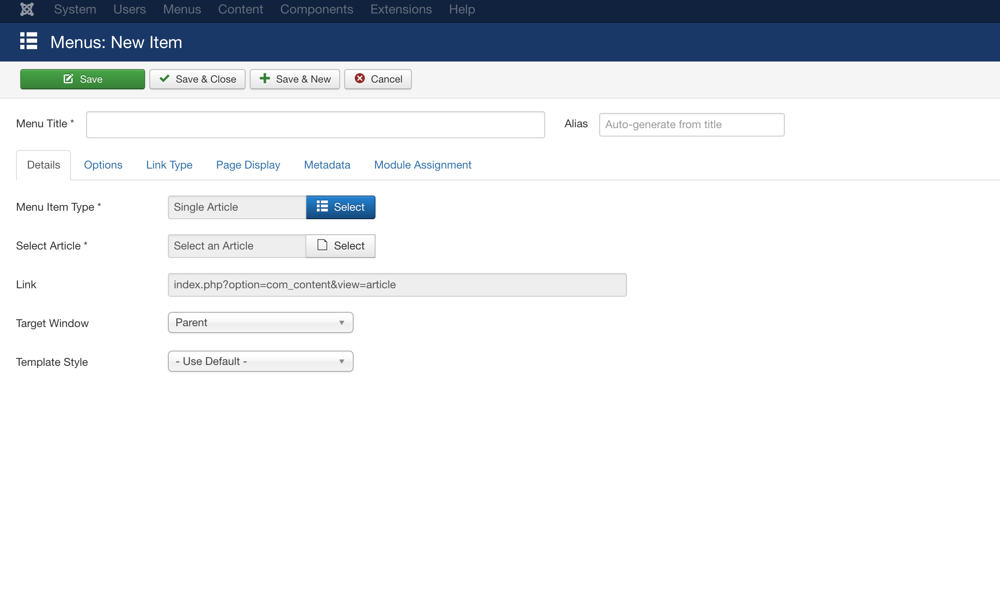

9. Click the select button beside the **Select Article** option and choose the buy sms page(article) you've created.
	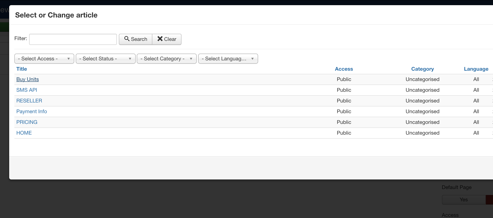
	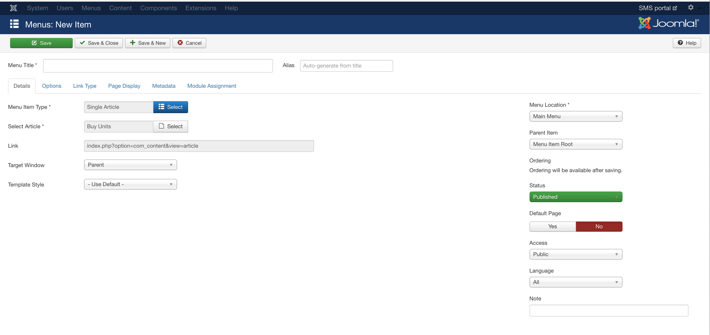

10. Save Menu and go to website to view the page created. 

## Notes 
I think step 6-10 can be optimized to be easier, my Joomla knowledge is weak. Please feel free to share your suggestions and send Pull Requests. 

[link-developer]: https://dashboard.paystack.co/#/settings/developer
[link-signup]: https://dashboard.paystack.co/#/signup
[link-releases]: https://github.com/Kendysond/Paystack-SPC-module/releases